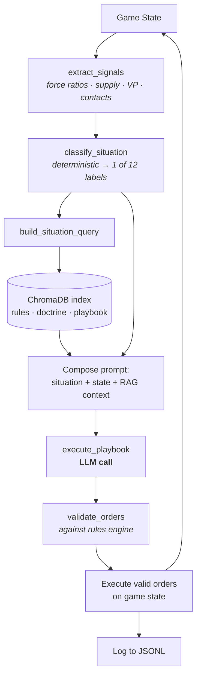
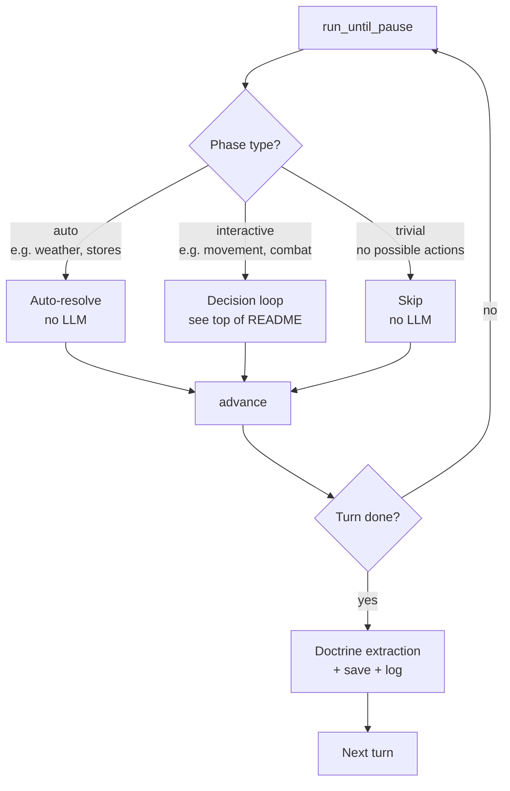
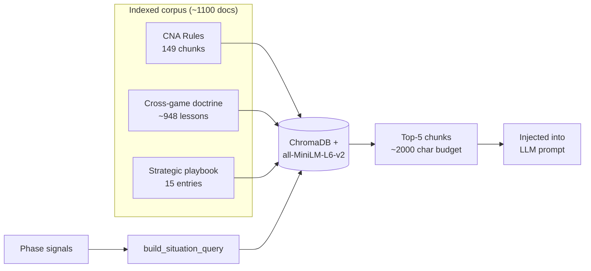

# Campaign for North Africa — LLM Game Engine

One of the first things that really made people take notice of AI was AlphaGo. DeepMind built a system that taught itself by playing itself millions of times — and Go, like chess, had centuries of recorded play and notation behind it. Neither is available for *The Campaign for North Africa*. **No completed game of CNA has ever been publicly documented** — most groups who attempt it spend years and only finish a handful of turns. The position space is also large enough that AlphaGo-style self-play training would need compute well past what a workstation can deliver. That combination — a massive, well-structured rule system with almost no human exploration — makes CNA an unusually interesting AI sandbox.

This project builds both the play surface and the agents that act in it:

- a **deterministic rules engine** covering the 1979 SPI rules plus errata and the NJHarman community rewrite
- a **RAG pipeline** retrieving relevant rules and accumulated cross-game doctrine on demand
- an **entourage architecture** with domain experts (ground, logistics, air, naval) coordinated by a general agent
- a leaner **situation-classification pipeline** that replaces the entourage in the default loop when one LLM call per phase is enough
- **tool-calling** support for agents to query the world before issuing orders

Qwen3-8B plays both sides through a full 111-turn Operation Compass scenario autonomously — overnight, on a single 24 GB laptop. The annotated turn-by-turn record in [`examples/game_summary_111turns.md`](examples/game_summary_111turns.md) is, as far as I know, **the first publicly documented CNA game played start-to-finish.**

**Per-phase decision loop:**



## Why This Game

CNA is interesting as an AI challenge for several reasons beyond its surface-level complexity:

- **It's a team coordination problem.** The rules explicitly divide responsibility across five roles per side (Commander-in-Chief, Logistics, Rear Area, Air, Front Line). Each role has partial information and different priorities. This maps directly to a multi-agent LLM architecture where agents must communicate, negotiate, and coordinate through structured messages.

- **Logistics dominates combat.** The vast majority of gameplay is supply management — fuel evaporation rates, water distribution, ammo allocation, port capacity, convoy routing. Winning requires unglamorous planning over many turns, not just tactical brilliance. This tests whether LLMs can maintain long-term strategic coherence.

- **The rules are a mess.** SPI published extensive errata admitting entire charts were printed backwards, rules contradicted each other, and some sections were incomprehensible even to the designer. NJHarman's community rewrite reorganized the rules for clarity. Our engine integrates the original rules, all official errata, and NJHarman's interpretations, with each deviation documented and tagged. This mirrors real-world software requirements: messy, contradictory specs that need careful interpretation.

- **No one has solved it.** There's no existing corpus of completed games to train on. The agents would need to develop strategy from the rules and mechanics themselves, through self-play.

## Source Material

The engine is built from five primary sources, layered with clear precedence:

| Layer | Source | Role |
|-------|--------|------|
| L1 | SPI Rules of Play (1979) | Original canonical rules |
| L2 | SPI Official Errata (Richard Berg) | Designer corrections — many are substantial |
| L3 | SPI Charts & Tables booklet | All CRTs and reference charts |
| L4 | Scenario rules & OOB sheets | Unit data, reinforcement schedules, setup |
| L5 | NJHarman rewrite (friendorfoe.com) | Community restructure for playability |

Every rule in the engine is tagged with its source layer and status (CANONICAL, PATCHED, DISPUTED, or OPTIONAL). When NJHarman's version differs from the original, both are documented with rationale and the engine provides toggles.

These are compiled into three reference documents in the project:

- **`files/CNA_UNIFIED_RULES.md`** — The complete land and logistics game rules with all errata integrated
- **`files/CNA_AIR_RULES.md`** — The air game rules (NJHarman's rewrite)
- **`CNA_DATA_TABLES.xlsx`** — All CRTs, terrain tables, aircraft data, ports, logistics tables, and key dates, errata-corrected

## Architecture

Pure Python with JSON game state. No external dependencies beyond `openpyxl` for initial data loading and `requests` for LLM API calls. The architecture is designed so that LLM agents interact with the game through a clean JSON interface — they read the game state, decide actions, and submit commands, while the engine enforces rules and resolves outcomes.

```
cna_engine/
├── models/                          # Data structures
│   ├── enums.py                     # All typed constants (sides, terrain, phases, etc.)
│   ├── game_state.py                # Complete state model (units, formations, hexes, air, naval)
│   └── serialization.py             # JSON save/load + compact LLM state summaries
├── data/
│   ├── reference_data.py            # Loads CNA_DATA_TABLES.xlsx into lookup structures
│   ├── reference_data.json          # Cached reference data
│   └── hex_map.py                   # Full 6,565-hex map loader (5 sections, cross-section adjacency)
├── engine/                          # Game rules & mechanics
│   ├── sequence_of_play.py          # NJH-restructured SoP state machine
│   ├── turn_runner.py               # Main turn loop, phase sequencing, pause points
│   ├── movement.py                  # Hex geometry, ZOC, terrain costs, reaction movement
│   ├── combat.py                    # Barrage, Anti-Armor, Close Assault CRT resolution
│   ├── supply.py                    # Fuel/water/ammo/stores, evaporation, trucks, dumps
│   ├── supply_lines.py              # Supply line tracing and convoy routing
│   ├── air.py                       # Missions, air combat, flak, bombardment, recon
│   ├── naval.py                     # Fleet sorties, convoy planning, port operations
│   ├── organization.py              # Formation attachment/detachment, reserves
│   ├── scenario.py                  # Scenario loader (Operation Compass OOB + map setup)
│   ├── sighting.py                  # Sighting and contact mechanics
│   ├── patrol.py                    # Patrol unit movement
│   ├── repair.py                    # Vehicle repair at facilities
│   ├── replacements.py              # Unit replacement and absorption
│   ├── weather.py                   # Weather determination
│   ├── victory.py                   # VP calculation and campaign end conditions
│   └── agent_interface.py           # Role-based state filtering, command schemas, prompt gen
├── orchestrator/                    # Multi-agent AI system
│   ├── orchestrator.py              # Main coordinator — runs full turns autonomously
│   ├── situation_engine.py          # Two-stage pipeline: signals → classification → playbook
│   ├── general.py                   # Commander agent — synthesizes expert input into orders
│   ├── experts.py                   # Domain experts (ground, logistics, air, naval)
│   ├── prompts.py                   # System prompts, response schemas, strategic ethos, phase guidance
│   ├── llm_backend.py              # LLM client abstraction (Ollama, MLX, mock)
│   ├── mock_strategies.py           # Smart mock LLM for testing without a live model
│   ├── memory.py                    # Turn memory and rolling context windows
│   ├── doctrine.py                  # Cross-game tactical lesson extraction and injection
│   ├── rag.py                       # Semantic retrieval (ChromaDB + sentence-transformers)
│   └── config.py                    # Model selection, temperature, expert roster
├── tests/                           # 30 test modules
│   ├── test_movement.py             # Hex coords, ZOC, terrain costs, stacking
│   ├── test_combat.py               # CRT validation + mini scenario
│   ├── test_supply.py               # Fuel/ammo, evaporation, trucks, dumps, water
│   ├── test_supply_lines.py         # Supply line tracing
│   ├── test_air.py                  # Air missions, combat, flak, recon
│   ├── test_naval.py                # Fleet and convoy operations
│   ├── test_scenario.py             # Scenario loading and OOB setup
│   ├── test_turn_runner.py          # Full turn execution and phase sequencing
│   ├── test_agent_interface.py      # Agent roles, state views, commands
│   ├── test_orchestrator.py         # Multi-agent orchestrator (14 tests)
│   ├── test_mock_strategies.py      # Mock LLM strategy validation
│   ├── test_memory.py               # Turn memory and context management
│   ├── test_organization.py         # Attachment/detachment, reserves
│   ├── test_sighting.py             # Sighting mechanics
│   ├── test_patrol.py               # Patrol movement
│   ├── test_repair.py               # Vehicle repair
│   ├── test_replacement.py          # Replacements and absorption
│   ├── test_weather.py              # Weather system
│   ├── test_victory.py              # Victory conditions
│   └── test_integration.py          # End-to-end integration tests
└── run_game.py                      # CLI game runner
```

### Game State

The `GameState` dataclass is the single source of truth. It contains:

- **TurnState** — Exactly where we are in the Sequence of Play (game turn, operation stage, phase, sub-phase, active side, initiative, weather, season)
- **Units** — Every counter on the map: position, TOE strength, current strength, CPA, cohesion, supply levels (fuel/water/ammo/stores), attached trucks, status flags
- **Formations** — Organizational hierarchy (company → battalion → brigade → division → corps) with membership tracking
- **HexState** — Dynamic map state per hex: units present, supply dumps, fortifications, airfields, sighting status, minefields
- **Air Game** — Individual aircraft, pilots (with experience and kill tracking), SGSUs (airbases)
- **Naval** — Commonwealth fleet state, Axis convoy planning and delivery tracking
- **Supply Pools** — Egyptian unlimited supply, Tripoli box tonnage, replacement pools, truck production queues

The full state serializes to JSON and round-trips cleanly through save/load.

### Sequence of Play

The SoP state machine implements NJHarman's restructured sequence, which reorders the original for logical flow and async play:

```
GAME TURN
├── Stores Expenditure Stage (evaporation, supply consumption, attrition)
├── Strategic Stage (air allocation, convoy planning, Malta missions)
└── Operation Stage ×3
    ├── Shared: Weather → Organization → Convoy Arrival → Fleet → Air → Initiative
    ├── "A" Side: Reserve → Movement & Combat → Vehicle Repair → Convoy Movement → Patrol
    └── "B" Side: (same sequence)
```

The Movement & Combat phase is internally repeatable — the active player can cycle through movement, breakdown, and combat segments as many times as desired within their CPA limits.

The orchestrator drives the SoP one phase at a time, calling the LLM only for interactive phases that have meaningful choices to make:



### Combat Resolution

Three combat systems are implemented, each with its own CRT:

**Barrage [12.6]** — Artillery fire against land units. Rolls d66 against a table indexed by barrage points (1-17+) and target class (infantry, armor, gun, truck). Results range from no effect through pinned to 1-2 strength points lost. Terrain shifts columns left (worse for attacker).

**Anti-Armor [14.6]** — Direct fire against armored vehicles. A large 18x17 CRT mapping d66 rolls against anti-armor points (0-16+) to armor protection points destroyed. The phasing player gets a one-row dice shift (representing the attacker's disadvantage). Terrain shifts columns.

**Close Assault [15.79]** — The decisive combat. Dual CRT with separate attacker and defender loss tables plus retreat and engaged results. Indexed by assault differential (-11 through +17+). Overrun occurs at +14 differential.

All three use CNA's distinctive d66 dice system (two d6 read as a two-digit number, 11-66) rather than summed 2d6.

**Combat result application:** CRT results are fully wired into the game state. When a barrage hits, target units lose SP (distributed from the strongest category first — infantry > armor > gun > mg > recon) and affected units are pinned. Anti-armor fire degrades `armor_protection` with overflow to armor SP. Close assault applies percentage losses to all participating units on both sides, then retreats surviving defenders 0-3 hexes away from attackers (maximizing distance from the nearest attacker hex). Units reduced to 0 total SP are marked DESTROYED. The engine auto-computes all force numbers from unit positions — the LLM only needs to specify `target_hex`, not barrage points or strength ratios.

**Suggested combat targets:** The ground expert's state view includes a `SUGGESTED COMBAT` section that identifies viable targets with computed force ratios (e.g., "TARGET B3210: ASSAULT ratio 2.6:1 (atk 42 vs def 16) → BARRAGE first: 6 BP vs infantry"). This gives the LLM concrete, pre-validated targets instead of requiring it to compute ratios from raw unit data.

### Situation Engine

The active decision pipeline is the **situation engine** (`situation_engine.py`), a two-stage system that replaces the earlier expert+general hierarchy:

```
Per Side, Per Phase:
  Stage 1: Extract Signals → Classify Situation
  Stage 2: Execute Playbook (LLM generates orders)

  Supply orders run independently — decoupled from operational classification
```

**How a phase plays out:**

1. The orchestrator hits an interactive pause point (e.g., "Awaiting movement_combat input from Allied")
2. **Trivial phase check** — the orchestrator inspects game state to determine if the phase has any possible actions (e.g., no units in reserve, no ready aircraft, fleet unavailable). Trivial phases are skipped instantly with no LLM calls.
3. **Signal extraction** — `extract_signals()` reads game state into a flat signal struct: force ratios, supply levels, contact state, VP scores, objectives held, units lost, etc.
4. **Situation classification** — `classify_situation()` maps signals to one of ~12 tactical situations: `ATTACK_PREPARED`, `DEFENSIVE_HOLD`, `FIGHTING_RETREAT`, `ADVANCE_OPPORTUNITY`, `AIR_SUPERIORITY_HELD`, `CONVOY_INTERDICTION`, `PATROL_DETERMINISTIC`, etc.
5. **Supply decoupling** — supply orders (water/fuel replenishment, convoy movement) are computed independently of the operational situation. This prevents supply crises from locking the army into pure resupply mode.
6. **RAG injection** — `build_situation_query()` maps the classified situation to a semantic query; ChromaDB retrieves relevant rules, doctrine, and playbook chunks (5 chunks, 2,000 char budget).
7. **Playbook execution** — the LLM receives the situation label, RAG context, battlefield state, and a supply advisory. It generates executable orders as structured JSON.
8. **Thinking budget scaling** — complex situations (`ATTACK_PREPARED`, `FIGHTING_RETREAT`) get 4,000 thinking tokens; moderate situations (`AIR_PARITY`) get 1,500–2,000; simple deterministic situations (`PATROL_DETERMINISTIC`) skip thinking entirely.
9. Orders are validated against the rules engine and executed in sequence.
10. Invalid commands are filtered out with graceful fallbacks; the phase always ends cleanly.

**Strategic prompt system:** Each side receives tailored strategic guidance:

- **Strategic Ethos** — Side-specific campaign objectives, VP awareness, decision frameworks (force ratios, supply thresholds), combined arms sequences, and supply discipline
- **Phase Guidance** — Role-specific and side-specific tactical instructions per phase. Allied ground experts get offensive guidance ("ADVANCE toward nearest objective, concentrate armor"), while Axis ground experts get defensive guidance ("HOLD current positions, fire barrages to disrupt approach, counterattack only weakened units")
- **VP injection** — The General's state summary includes current victory point scores, margin, and objectives held, so it knows whether it's winning or losing

**Force ratio display:** At contact points (friendly units adjacent to enemy), the ground expert's state view shows computed SP ratios (e.g., "3.6:1 advantage at hex B2915"), enabling informed assault/hold decisions.

**Command schema system:** Each command includes a parameter reference (types, valid enum values) embedded directly in the prompt, so the LLM knows exactly what parameters to use. Unit IDs are shown inline with unit names in the state view (e.g., `[cw_2rtr] 2nd Royal Tank Regiment`) to prevent the LLM from guessing IDs.

**LLM output coercion:** The `_coerce_params()` system in `agent_interface.py` handles common LLM output format issues — converting string values to floats for numeric parameters, and converting `"supplies": "water"` to `{"water": 5.0}` for truck_load/truck_unload commands. This prevents crashes from minor format deviations while preserving the intent.

**LLM backend:** Two backends are supported — **Ollama** (`/api/chat`) and **MLX** (`mlx_lm.server`, OpenAI-compatible `/v1/chat/completions`). Both use the same `chat()` interface and are selected via `--backend ollama|mlx`. The MLX backend passes Qwen3's `budget_tokens` thinking control via `chat_template_kwargs`, enabling extended reasoning for complex decisions. JSON extraction is done client-side via `extract_json()`, which strips gpt-oss channel markers (`<|channel|>analysis/final`), code fences, and balanced brace matching — no server-side JSON mode constraint is used, as it caused empty-content failures with many models. Falls back to a smart mock LLM for testing without a running model.

### RAG Pipeline

The orchestrator includes a semantic retrieval system (`rag.py`) that provides situationally relevant context to agents instead of dumping flat lesson lists.



**Knowledge sources:**
- **CNA Rules** (~1,900 lines across 2 files) — chunked by section headers into ~500-token chunks
- **Doctrine lessons** (`logs/doctrine.jsonl`) — cross-game tactical lessons, deduplicated
- **Strategic playbook** (`files/strategic_playbook.jsonl`) — 15 curated tactical entries covering assault prep, supply chains, retreat criteria, defensive positioning, combined arms, etc.

**Stack:** ChromaDB (in-memory) + sentence-transformers (`all-MiniLM-L6-v2`, 22MB CPU model). Indexes ~1,100 documents at startup (78 rules chunks, 71 air rules, ~948 doctrine entries, 15 playbook entries). Queries take <10ms.

**Query strategy:**
- **Experts** query with role + phase + state signals (units in contact? supply critical? advancing?)
- **General** queries with side + phase + VP trend ("losing by 3 VP, need aggressive attack")
- Token budget: 1,500 chars for experts, 2,000 chars for General (3-5 relevant chunks)

### Hex Map

The engine uses the full CNA map — 6,565 hexes across five map sections (A through E), with terrain data extracted from the VASSAL module image.

- **Hex ID format:** `{Section}{Col:02d}{Row:02d}` — e.g., `E1326` = Alexandria, `A3511` = Tripoli, `C0512` = Tobruk, `D0821` = Sidi Barrani
- **Cross-section adjacency:** Seamless movement across section seams (A39↔B2, B39↔C2, C39↔D1, D39↔E2) using global column coordinate mapping
- **Terrain types:** Desert, coast, escarpment, salt marsh, sand sea, oasis, and more — each with correct movement costs and combat modifiers
- **Named locations:** 30 cities, ports, and airfields with strategic significance
- **Key distances:** Alexandria → Tripoli = 131 hexes, Alexandria → Sidi Barrani = 43, Sidi Barrani → Sollum = 30
- **Pathfinding:** Server-side Dijkstra — the LLM specifies a destination hex and the engine computes the optimal path

### Doctrine System

The doctrine system (`doctrine.py`) extracts tactical lessons from game logs and feeds them back into future games:

- After each game (or every 5 turns during long games), `extract_lessons()` analyzes the JSONL game log
- Lessons are categorized: success patterns (commands that consistently work), failure patterns (commands that consistently fail), and supply insights
- Lessons are stored in `logs/doctrine.jsonl` and indexed into the RAG pipeline
- New lessons from the current game are incrementally added to the RAG index

### Reference Data

The `reference_data.py` module loads from `CNA_DATA_TABLES.xlsx` and provides lookup functions:

- 16 terrain types with movement costs, combat shifts, stacking limits
- Hexside effects (escarpment, slope, ridge, wadi, river)
- 29 aircraft with NJH classifications, maneuver ratings, range, fuel consumption
- 11 ports with capacity, tonnage, repair facilities
- Initiative ratings by game turn period
- Evaporation rates (pre/post jerrycan adoption)
- Fuel consumption chart (CP x rate matrix)
- Ammunition consumption rates per action type
- 29 key date events with rule references

## Current State

~35,000 lines of Python across 79 modules.

| Layer | Modules | Lines | Status |
|-------|---------|-------|--------|
| Models | 4 | ~860 | Complete |
| Data | 3 | ~510 | Complete (includes hex_map.py) |
| Engine | 21 | ~11,200 | Complete for Operation Compass |
| Orchestrator | 15 | ~9,150 | Working — situation engine, RAG, doctrine |
| Tests | 30 | ~10,900 | Core tests passing |
| Tools/CLI | 6 | ~1,200 | Working |
| **Total** | **79** | **~35,000** | |

### What Works

- **Full 111-turn game completed autonomously** — Operation Compass scenario, both sides played by Qwen3-8B, 493 minutes total (~4.4 min/turn), historically plausible result
- **Full 6,565-hex map** — 5 map sections (A–E) with real terrain data extracted from the VASSAL module, cross-section adjacency, 30 named locations (cities, ports, airfields)
- All game systems functional: movement, combat, supply, air, naval, weather, sighting, patrol, repair, replacements, victory conditions
- **Situation engine** — two-stage pipeline (signal extraction → classification → playbook) with 12 tactical situations, replacing the earlier expert+general hierarchy
- **Decoupled supply** — supply orders run independently of operational classification, preventing the supply death spiral where armies oscillate between resupply and inaction
- **Thinking budget scaling** — complex situations get 4,000 thinking tokens, simple ones skip thinking entirely, cutting turn times without sacrificing decision quality
- **Combat results applied to game state** — barrage SP losses + pinning, anti-armor degradation, close assault % losses + retreat + destruction. Engine auto-computes force numbers; LLM only sends `target_hex`.
- Trivial phase skipping reduces LLM overhead by ~40%
- Save/load with auto-save after each turn; resume from any save with `--load`
- RAG pipeline (ChromaDB + sentence-transformers) retrieves relevant rules, doctrine, and playbook entries per situation (~1,100 indexed documents)
- Cross-game doctrine extraction feeds tactical lessons back into future games
- Side-aware strategic prompts: Allied attacks toward objectives, Axis defends in place
- LLM output coercion handles common format mismatches gracefully
- **Game report export** — `tools/export_log_sheets.py` generates styled XLSX reports with unit status, orders, turn summaries, and aircraft sheets

### Performance

The full 111-turn game completed in 493 minutes (~4.4 min/turn average) on Qwen3-8B-4bit via `mlx_lm.server` (M4 Pro, 24GB). Turn times range from ~45s (late-game deterministic phases) to ~95s (early-game complex combat).

| Backend | Model | Avg Turn | Order Success | Notes |
|---------|-------|----------|---------------|-------|
| MLX | Qwen3-8B-4bit | ~4.4 min | 100% | Recommended. Thinking budget scaling. |
| Ollama | qwen3:8b | ~8 min | 99%+ | Same model family, ~30 tok/s |
| MLX | gpt-oss:20b MXFP4-Q8 | ~15 min | 90%+ | Larger model, slower |
| Ollama | gpt-oss:20b | ~14 min | 82% | JSON mode issues with logistics |

Key optimizations:

- **Thinking budget scaling** — Complex situations (`ATTACK_PREPARED`, `FIGHTING_RETREAT`, `COUNTERATTACK`) get 4,000 thinking tokens. Moderate situations (`AIR_PARITY`, `CONVOY_INTERDICTION`) get 1,500–2,000. Simple deterministic situations (`PATROL_DETERMINISTIC`, `DEFENSIVE_HOLD`) skip thinking entirely. This cut average turn time from ~8 min to ~4.4 min.
- **Trivial phase skipping** — 12 of 25 interactive phases are detected as having no possible actions (no units in reserve, no ready aircraft, fleet unavailable, etc.) and skipped without any LLM calls. Eliminates ~24 wasted LLM round-trips per turn.
- **Supply decoupling** — Supply orders are computed independently of the operational classification. This prevents the supply death spiral observed in earlier versions, where armies oscillated between 100% resupply turns and brief operational windows.
- **Client-side JSON extraction** — JSON is extracted from freeform model output via `extract_json()`, including stripping gpt-oss's internal `<|channel|>analysis/final` reasoning markers. No server-side JSON mode constraint needed.
- **LLM output coercion** — `_coerce_params()` catches and fixes common LLM format errors (strings where dicts expected, strings where floats expected) rather than crashing.

## Running

```bash
# Play 2 turns with MLX Qwen3 (recommended)
mlx_lm.server --model mlx-community/Qwen3-8B-4bit --port 8080  # in one terminal
python run_game.py --backend mlx --turns 2 --verbose             # in another

# Play with Ollama
python run_game.py --turns 1 --verbose                           # requires Ollama running

# Play with smart mock LLM (no LLM server needed)
python run_game.py --mock --turns 3

# Use a different model
python run_game.py --model qwen3-30b-a3b --turns 1

# Resume from a save
python run_game.py --load saves/gt3.json --turns 2

# Run orchestrator tests (16 tests, no LLM required)
python -m cna_engine.tests.test_orchestrator

# Run individual test modules
python -m cna_engine.tests.test_combat
python -m cna_engine.tests.test_movement
python -m cna_engine.tests.test_supply
python -m cna_engine.tests.test_integration
# ... (21 test modules total)
```

### MLX Setup (Apple Silicon)

```bash
pip install mlx-lm chromadb sentence-transformers
mlx_lm.server --model mlx-community/Qwen3-8B-4bit --port 8080
# Then in another terminal:
python run_game.py --backend mlx --turns 2 -v
```

The MLX backend auto-defaults to `mlx-community/Qwen3-8B-4bit` (~6GB VRAM). Model weights are downloaded automatically on first run.

### Dependencies

```bash
# Core (required)
pip install openpyxl requests

# RAG pipeline (optional — game works without it, just no semantic retrieval)
pip install chromadb sentence-transformers

# MLX backend (optional — for Apple Silicon inference)
pip install mlx-lm
```

### Game Logs & Saves

Each game run produces:
- **Save file** — `saves/gtN.json` after each turn (full game state, resumable)
- **Game log** — `logs/game_YYYYMMDD_HHMMSS.jsonl` (structured JSONL, one event per line)
- **Doctrine** — `logs/doctrine.jsonl` (cross-game tactical lessons, appended after each game)
- **Python log** — `logs/cna_YYYYMMDD_HHMMSS.log` (standard logging output)

Game logs record every phase, expert assessment, order, and result. They can be parsed for analysis:

```bash
# Show all expert reasoning and orders from a game
python3 -c "
import json
with open('logs/game_20260301_141908.jsonl') as f:
    for line in f:
        e = json.loads(line)
        if e.get('type') == 'phase' and not e.get('skipped'):
            side = e['side']
            phase = e['sub_phase']
            orders = e.get('orders', [])
            ok = sum(1 for o in orders if o.get('success'))
            print(f'{side:6s} {phase:30s} {ok}/{len(orders)} orders')
"
```

## Example Game Output

The `examples/` directory contains output from a complete 111-turn Operation Compass game (GT1–GT111), played entirely by Qwen3-8B on an M4 Pro MacBook:

- **`game_summary_111turns.md`** — Turn-by-turn narrative summary showing how the AI played
- **`game_report_111turns.xlsx`** — Styled spreadsheet with unit status, orders, turn summaries, and aircraft data (modeled after CNA's original paper log sheets)

## What's Next

1. **Full coast road mapping** — Only named cities currently have `RoadType.ROAD`. Mapping the complete coast road hex-by-hex would improve movement pathfinding realism.
2. **Shorter scenarios** — Add a "Desert Fox" scenario (Rommel's arrival, ~GT25+) or a 20-turn practice scenario with tightened VP thresholds.
3. **Interactive replay viewer** — Turn-by-turn web viewer showing unit positions on the hex map, with orders and combat results overlaid. The data is all in the JSONL game logs.
4. **Better model evaluation** — Compare command quality across different local models (qwen3, llama, mistral, gemma, etc.) using the doctrine system to measure learning.
5. **Self-play learning** — Game loop that runs many games and feeds outcomes back into agent context via the doctrine system. Track VP trends over generations.
6. **Full campaign** — Extend scenario data beyond Operation Compass to cover the full Sep 1940 – Jan 1943 timeline (GT1–GT131, reinforcement schedules, Rommel's arrival, Torch).
7. **Tool-calling mode** — The situation engine supports both JSON-output and tool-calling LLM interfaces. Tool-calling is wired but not yet the default path.

## A Note on the Game's Spirit

The SPI errata opens with a quote worth repeating:

> "We would like to make a pitch here for initiative: if you find something that is obviously wrong, instead of putting the game aside and waiting three months for the answer to your question, please try to resolve it yourself. After all, these games were not delivered on mountain tops writ on fiery tablets...the designer simply made up everything you have read (except the hardware.) And if he can do it, so can you. Try it."
>
> — Richard Berg, CNA Errata, September 1979

We take him at his word. Where the rules are ambiguous or contradictory, we make a ruling, document the reasoning, and move on. The engine provides option toggles for the most significant house rules so they can be evaluated through play.
